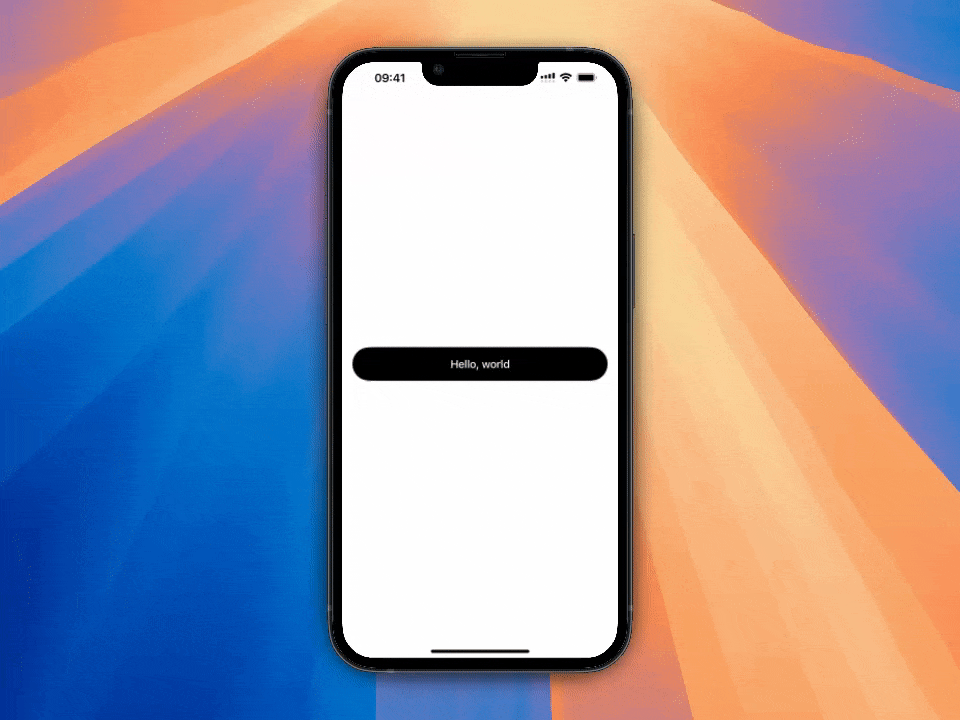
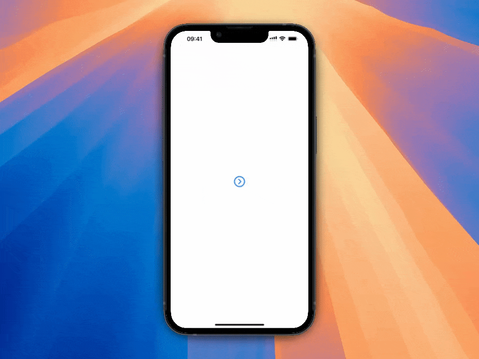
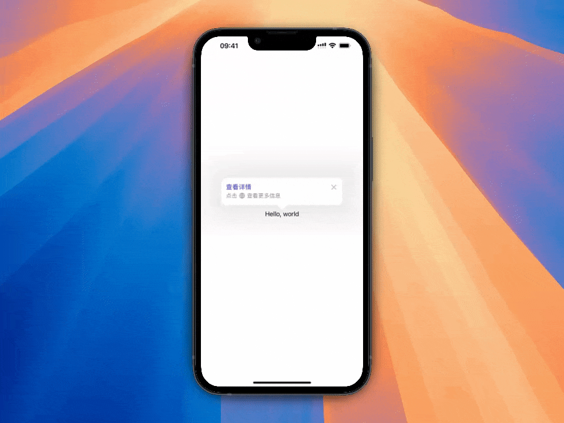
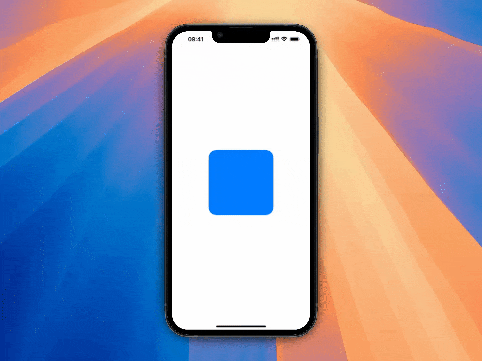
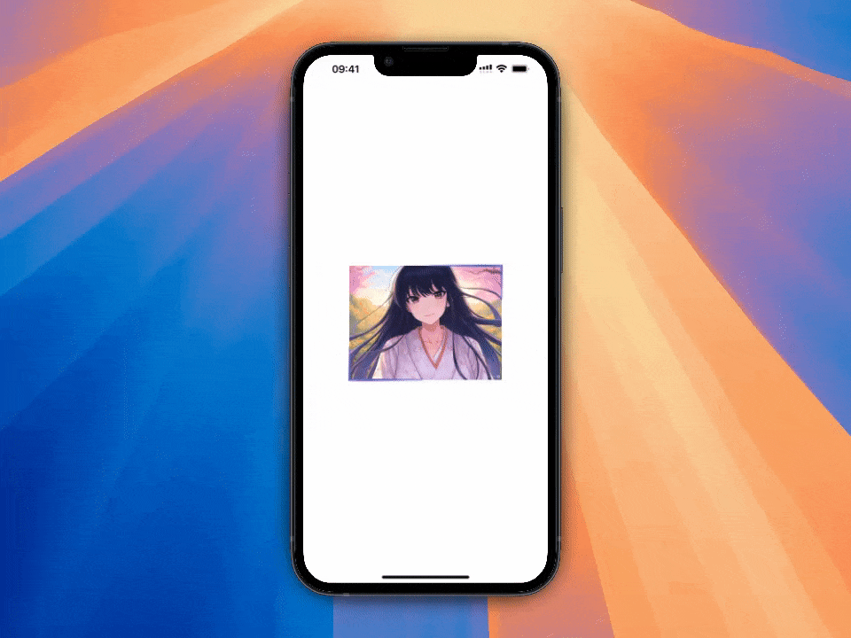
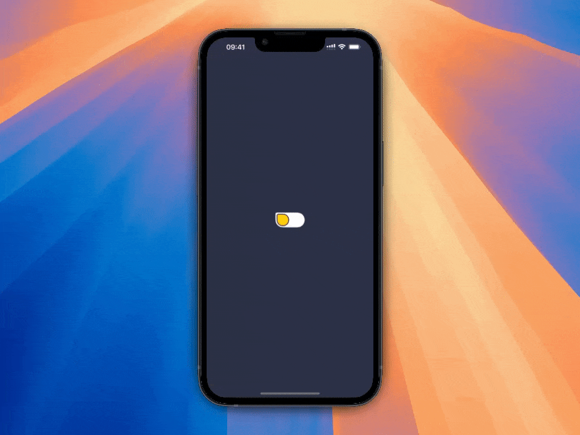
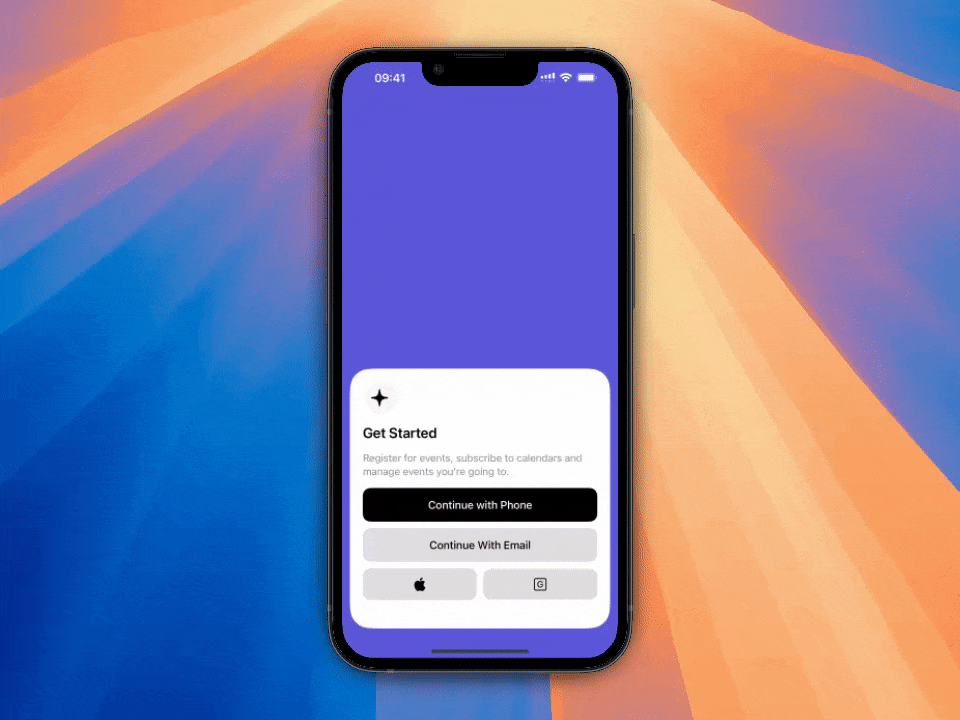
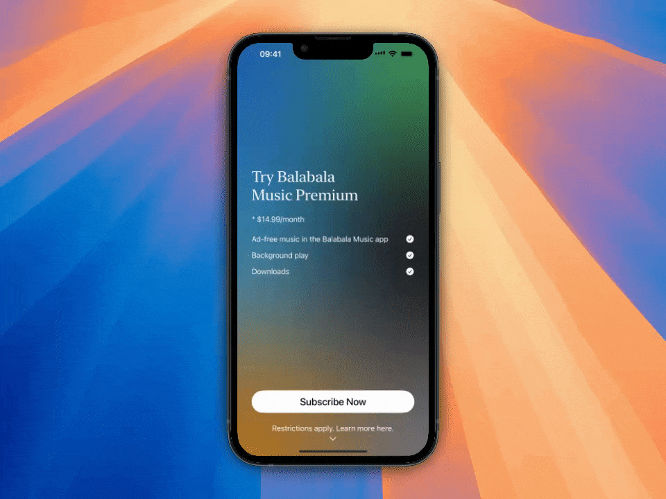
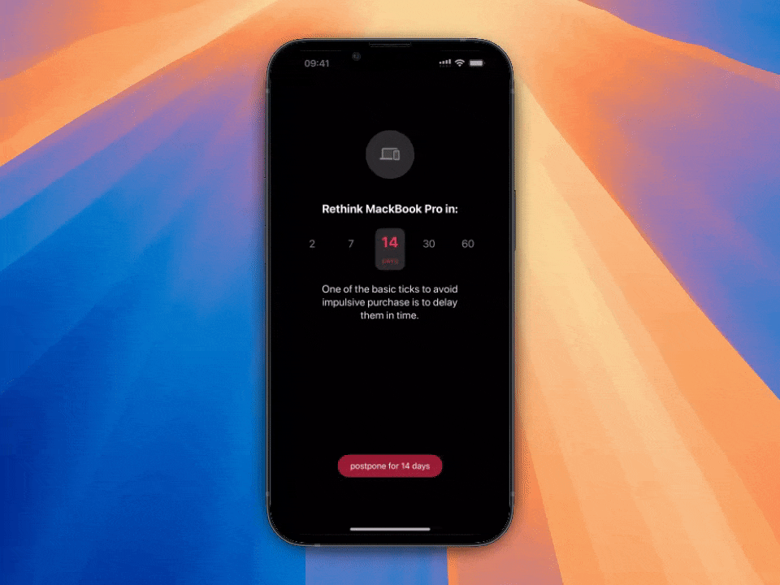
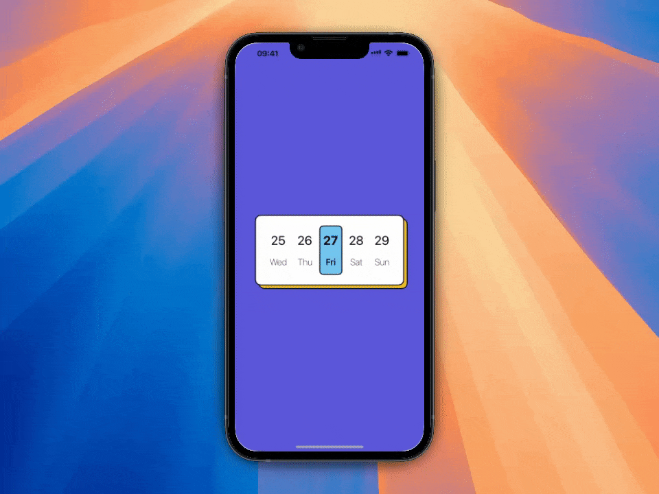

# SwiftUICodeSnippets
这里是短视频中创建的所有代码, 希望大家喜欢, 如果发现有任何问题欢迎大家提 issues 或者 PR

## 目录
001-500 为已发布的代码

501-??? 为草稿代码, 属于制作视频时的副产物 = =

# 欢迎大家加入我的知识星球
- 这里我会分享视频中代码想法的由来 (以及相关知识点和资料)
- 还会发布一些详细的代码讲解文章 (后期会和视频更新保持同步)
- 同时也会发一些 SwiftUI 和 iOS 独立开发相关的文章
- 如果你感兴趣的话, 欢迎加入一起讨论学习

# 预览效果

### [001-RainbowText](/SwiftUICodeSnippets/001-RainbowText)

### [002-ScaledButton](/SwiftUICodeSnippets/002-ScaledButton)

### [003-ButtonRotationAnimation](/SwiftUICodeSnippets/003-ButtonRotationAnimation)

### [004-SegmentedControl](/SwiftUICodeSnippets/004-SegmentedControl)

### [005-SymbolImageAnimation](/SwiftUICodeSnippets/005-SymbolImageAnimation)

### [006-PopoverTip](/SwiftUICodeSnippets/006-PopoverTip)

### [007-PolishAnimation](/SwiftUICodeSnippets/007-PolishAnimation)

### [008-NavigationTransition](/SwiftUICodeSnippets/008-NavigationTransition)

### [009-ImageTransition](/SwiftUICodeSnippets/009-ImageTransition)

### [010-StickyHeader](/SwiftUICodeSnippets/010-StickyHeader)

### [011-RainbowButton](/SwiftUICodeSnippets/011-RainbowButton)

### [012-AnimatedBorder](/SwiftUICodeSnippets/012-AnimatedBorder)

### [013-FunnyToggle](/SwiftUICodeSnippets/013-FunnyToggle)

### [014-TodoCell](/SwiftUICodeSnippets/014-TodoCell)

### [015-ScrollTransition](/SwiftUICodeSnippets/015-ScrollTransition)

### [016-MeshGradient](/SwiftUICodeSnippets/016-MeshGradient)

### [017-LoginPage](/SwiftUICodeSnippets/017-LoginPage)

### [018-SubscribePage](/SwiftUICodeSnippets/018-SubscribePage)

### [019-NumericAnimation](/SwiftUICodeSnippets/019-NumericAnimation)

### [020-WaveShader](/SwiftUICodeSnippets/020-WaveShader)

### [021-SnowShader](/SwiftUICodeSnippets/021-SnowShader)

### [022-DaysPostponement](/SwiftUICodeSnippets/022-DaysPostponement)

### [023-CalendarCard](/SwiftUICodeSnippets/023-CalendarCard)

